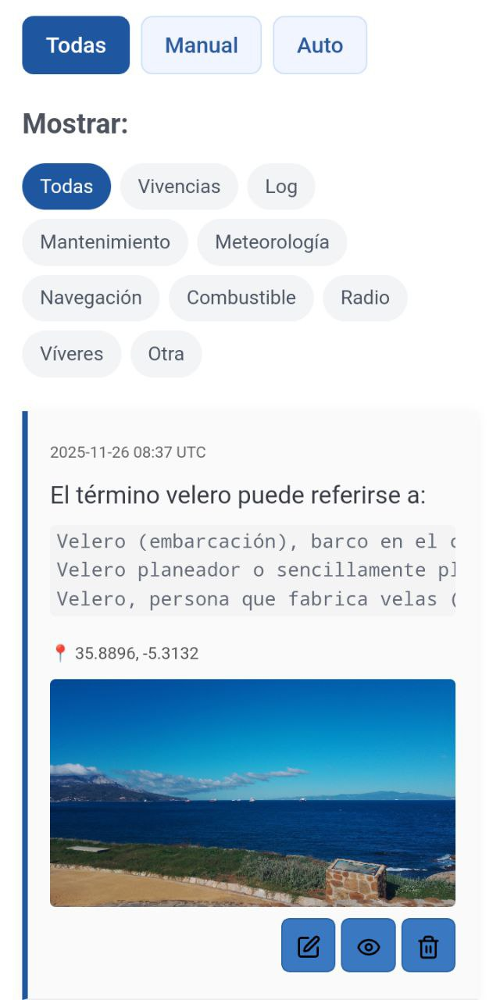
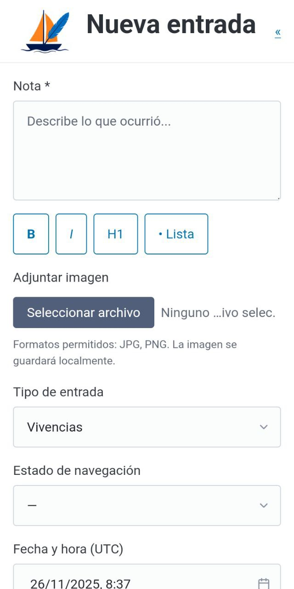
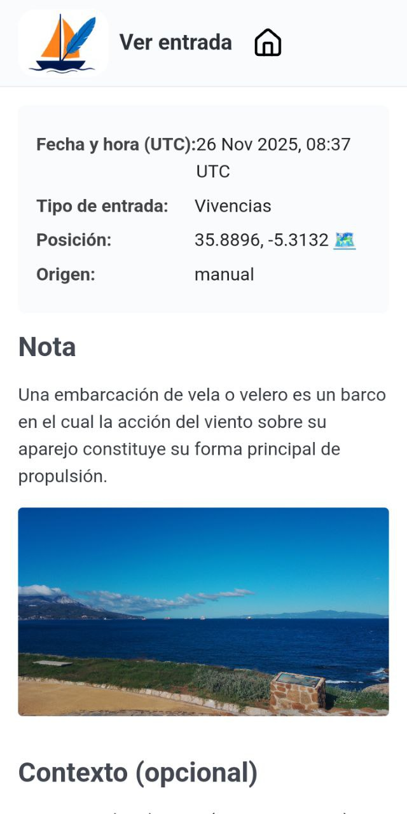
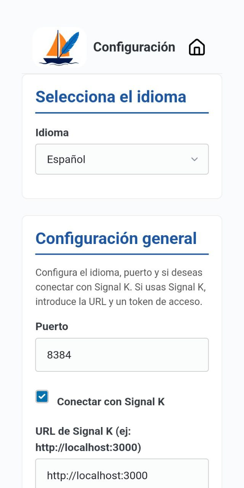

# Logbook — Offline-First Nautical Journal

> *An offline-first logbook for sailors who write with heart and navigate with data.*

**Logbook** is an autonomous, lightweight journal designed to work even when the horizon has no signal.  
It runs perfectly on its own—but if you introduce it to **Signal K**, it falls head over heels 😊.

---

### A special relationship with Signal K

Although **fully functional offline**, Logbook gains extra depth when paired with a Signal K server:

- When you write a note, it can **automatically record** your position, course, wind speed, sea state… whatever your system is sending.
- You can configure it to **publish every entry (or only the ones you choose)** to Signal K’s `notes` resource.
- These notes will then appear in tools like **Freeboard, KIP, or any compatible interface**, as if you’d added them directly there.

> In short: if Signal K is aboard, Logbook doesn’t just save your words—it captures the **full context of the moment you wrote them**.

---

### A personal project, born on deck

This journal emerged from a real need: **I use it aboard my own boat**.  
It’s not a commercial product, nor does it aim to be infinitely customizable for every user. It’s simple, functional, and sincere.

**What can you expect?**
- A **useful, self-contained tool** for logging your voyage.
- **Possible bugs or rough edges**, because it’s evolving (and the sea teaches humility!).
- Slow but thoughtful updates.

If you’re looking for perfection, this might not be for you.  
But if you want a faithful logbook companion that respects your privacy and works without internet… welcome aboard.

---

### Not a mobile app… but built for mobile

Logbook is **not a native Android or iOS app**.  
It’s a **lightweight web server**, designed to run on a **Raspberry Pi**, NUC, or any Linux system on your local network.

However:
- It’s **mobile-first**: looks and works great on phones.
- You can access it from any device on your boat’s network: `http://bitacora.local:5000`.
- You can even **install it as a PWA** (Progressive Web App) on your device for quick access.

---

### Automation and API

Want to integrate Logbook with **Node-RED**, custom scripts, or external systems?  
We provide a **lightweight REST API** to create, read, update, or delete entries—and even trigger backups from another system.

➡️ **Full API documentation**: [../en/api.md](../en/api.md)

---

### Installation

We include a simple installation script (`install.sh`) that sets everything up automatically on your Raspberry Pi or Linux machine: Python virtual environment, systemd service, `.local` hostname, data directories, and more.

➡️ **Detailed installation guide**: [../en/installation.md](../en/installation.md)

---

### Screenshots

<tool_call>
{"name": "search_image", "arguments": {"prompt": "Logo Derrotero"}}
</tool_call>

  
  

  
  

>  Clean, functional interface—optimized for mobile, even under bright sun on deck.

---

### ❤️ Acknowledgments

- **Icons**: [Lucide](https://lucide.dev), ISC licensed.
- **Styles**: [Pico.css](https://picocss.com), proving that less is more.
- **Signal K**: for making navigation data free and open.

---

> *“The logbook never lies. It keeps what you were, what you saw, and what you dreamed while the boat cut through the water.”*  

**Sail with data. Write with soul.** 
